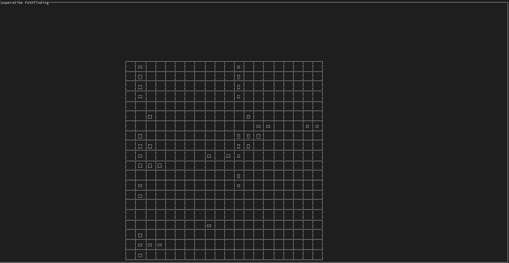

# Cooperative Pathfinding

the initial goal of this project is to prototype a WHCA* based on [the implementation of David Silver](https://www.davidsilver.uk/wp-content/uploads/2020/03/coop-path-AIIDE.pdf)

## Run & Build
`cargo run`
